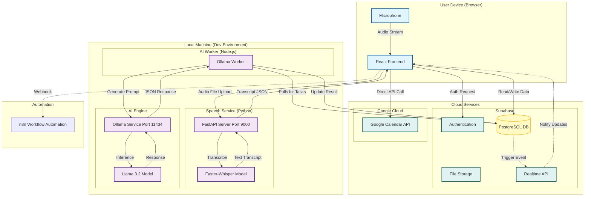

# Infrastructure Diagram

This diagram illustrates the infrastructure and data flow of the **Cal Speak Buddy** project.

## Component Description

### 1. Client (Frontend)
- **React + Vite**: The main user interface running in the browser.
- **Microphone**: Captures user voice commands.
- **Direct Integrations**: Communicates directly with Supabase (for data) and Google Calendar (via OAuth).

### 2. Speech Service (Python)
- **FastAPI**: Exposes an API on port 9000.
- **Faster-Whisper**: Runs locally to transcribe audio to text with high accuracy.
- **Flow**: Receives audio from frontend -> Transcribes -> Returns text.

### 3. AI Worker (Node.js)
- **Ollama Worker**: A background service that polls the Supabase database for new inquiries or tasks.
- **Logic**: It picks up tasks, sends prompts to the local Ollama instance, and saves the AI-generated response back to the database.

### 4. AI Engine (Local)
- **Ollama**: Runs the Llama 3.2 model locally on port 11434.
- **Privacy**: All reasoning happens locally; no data is sent to external AI providers (like OpenAI).

### 5. Cloud Services
- **Supabase**: Acts as the backend-as-a-service.
    - **PostgreSQL**: Stores user profiles, inquiries, and application state.
    - **Auth**: Handles user login and session management.
    - **Realtime**: Pushes updates to the frontend when the AI Worker completes a task.
- **Google Calendar**: Accessed directly by the frontend using the user's OAuth token to manage events.
